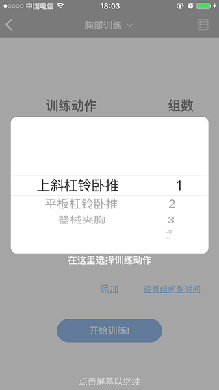
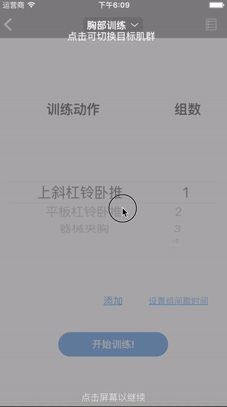

# CYGuidanceView
A light weight guidance view for iOS ! An easy way to show a guide tour for your user !

## Preview

## Installation
Add `pod 'CYGuidanceView'` to your Podfile.

## Usage
Add `#import "CYGuidanceView.h"` to your file ,and construct the guide view :

<pre>
<code>
//1
	CYGuidanceView *guide = [CYGuidanceView new];
	
	//2.  calculate and initialize your description view.
	
	//3.
	GuideInfo *info = [[GuideInfo alloc]
						 initWithGuideRect:(Frame that you want to high light)
						 descriptionView:(A view that describes your high light part) 
						 verticalPosition:(Vertical position for description view) 
						 horizontalPosition:(Horizontal position for description view)
						 cornerRadius:(Corner radius for highlighted rectangle)];
						 
						 
	//4.
	[guide addStep:@[info]];
	
	//5.
	[guide showInView:(View that shows the guide) animated:(animate or not)];
</code>
</pre>

A quick tour of what's going on :

1.Initialize the guidance view.

2.Initialize the description view if needed.

3.Initialize guide info for the guidance view base on information that you passed to the init method. (The position you passed in is RELATIVE to the first argument's origin , you can also call another init method which allows you to pass in a CGPoint to specify the relative position of the description view.)

4.Add "Step" to the guide view ,a step can be consist of multiple guide info , and one tap on the guide view means a step forward.

5.After adding steps to the guide view , show the guide view.

And after user go through all the steps in your guide tour , the guide view is removed and deallocated automatically.

For more detail ,please download the sample project.

## License
This project is under MIT License.